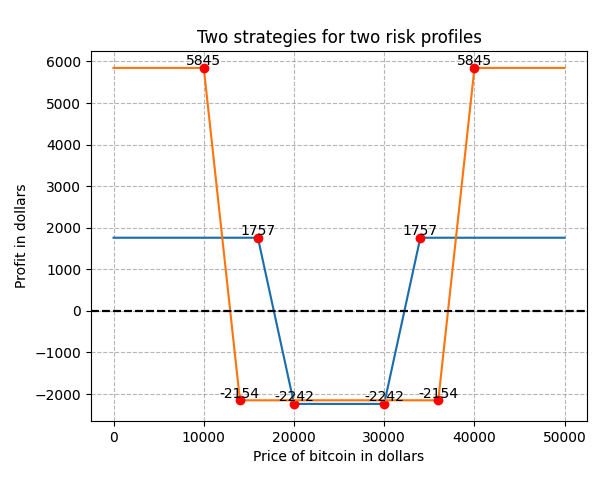
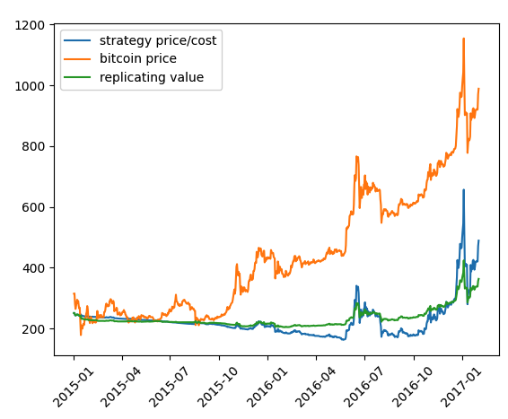

# Reverse Iron Condor Pricing

This is the code of a project for LLSMS2225 Derivatives pricing followed in 2022-2023 at UCL, given by Prof Frederic Vrins

## Overview

This project implements a Python-based framework for analyzing, simulating, and pricing options strategies, focusing on reverse iron condors. The framework includes methods for:

- Calculating option payoffs and profits.
- Pricing options using the Black-Scholes model.
- Visualizing strategy payoff diagrams.
- Simulating stock prices using Monte Carlo methods.
- Performing delta hedging to replicate option strategies.

## Features

### Core Classes
- **Stock**: Represents a traded security, retrieves historical prices using `yfinance`, and calculates returns and volatility.
- **Option**: A base class for European-style options with methods for calculating prices, payoffs, and deltas.
  - Subclasses include `LongCall`, `LongPut`, `ShortCall`, and `ShortPut`.
- **Strategy**: Represents a collection of options and calculates combined prices, payoffs, profits, and deltas.
- **MonteCarlo**: Simulates stock price paths and calculates fair strategy prices.
- **Delta Hedging**: Implements a replication portfolio strategy for options.

### Strategies
- Example strategies include:
  - **Strangle**: A long put and a long call with different strike prices.
  - **Iron Condor**: Combines long and short calls and puts to form a complex strategy.

## Dependencies

- `numpy`
- `pandas`
- `matplotlib`
- `yfinance`
- `scipy`

Install the dependencies using:
```bash
pip install numpy pandas matplotlib yfinance scipy
``` 

# Results


